# Breast Cancer Classification using Logistic Regression - Dataset Analysis

Google Colab Link: [https://colab.research.google.com/drive/14hRQ5DHeDiFlLOl682qyE3ce8MYDfO2o?usp=sharing](https://colab.research.google.com/drive/14hRQ5DHeDiFlLOl682qyE3ce8MYDfO2o?usp=sharing)

Dataset source: [https://www.kaggle.com/datasets/yasserh/breast-cancer-dataset](https://www.kaggle.com/datasets/yasserh/breast-cancer-dataset)

GitHub Repo: [https://github.com/MFoxx/Breast-Cancer-Classification-using-Logistic-Regression](https://github.com/MFoxx/Breast-Cancer-Classification-using-Logistic-Regression)

## Data Analysis

### Dataset Information

Breast cancer stands as the prevalent form of cancer among women globally, constituting 25% of all cancer diagnoses and impacting over 2.1 million individuals in 2015 alone. The disease initiates when breast cells undergo uncontrolled growth, typically resulting in the formation of tumors detectable through X-rays or palpable as lumps in the breast region.

A critical obstacle in the battle against breast cancer lies in accurately categorizing tumors as either malignant (cancerous) or benign (non-cancerous) for effective detection.

Dataset can be used with Logistic Regression ML models to classify data as malignant or benign.

Dataset contains 569 entries and 32 columns.

Dataset doesn't contain any null values.

### Understanding the data

`id`

- Unique identifier
- Redundant
- Type: int64

`diagnosis`

- M: Malignant (cancerous tumours)
- B: Benign (non-cancerous tumours, won't spread)
- Classification target
- Type: string (M/B)

Latter properties are characterized in three categories:

- mean
- worst
- se

`radius`

- Radius of the lobes
- Type: Float

`texture`

- Surface Texture
- Type: Float

`perimerter`

- Outer Perimeter of Lobes
- Type: Float

`area`

- Area of Lobes
- Type: Float

`smoothness`

- Smoothness Levels
- Type: Float

`compactness`

- Compactness
- Type: Float

`concavity`

- Concavity
- Type: Float

`concave_points`

- Concave_points
- Type: Float

`symmetry`

- Symmetry
- Type: Float

`fractal_dimensions`

- Fractal dimensions
- Type: Float

### Diagnosis distribution

37.25% of data is labeled as Malignant (212)  
62,741% of data is labeled as Benign (357)

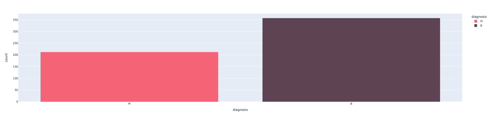

### Data correlations with diagnosis

1. **Area**

   - Lower mean area suggests Benign type of tomour, with some overlap

   Mean area:
   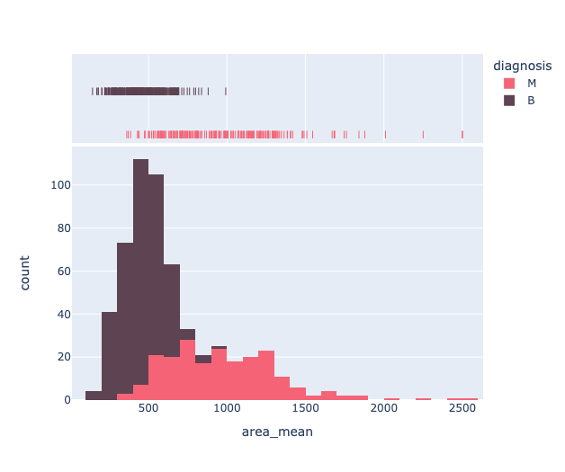
   Worst area:
   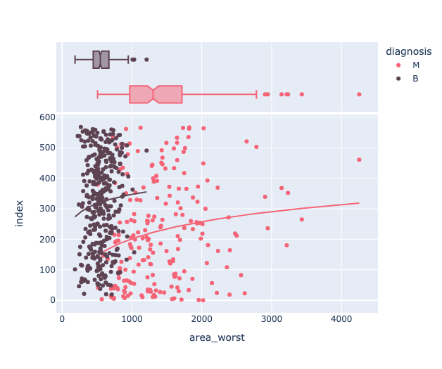
   Area SE:
   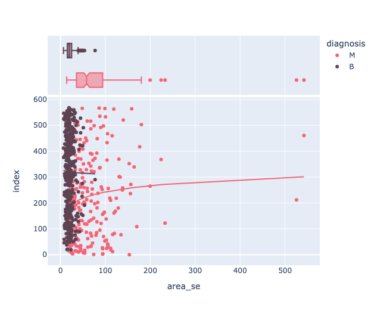

2. Radius

   - Lower mean radius suggests Benign type of tomour, with some overlap

   Mean radius:
   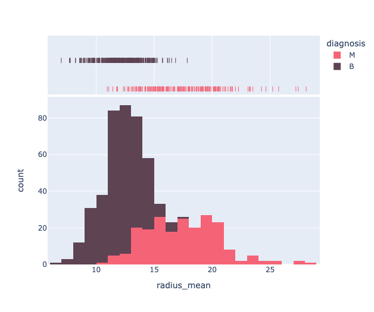

   Radius worst:
   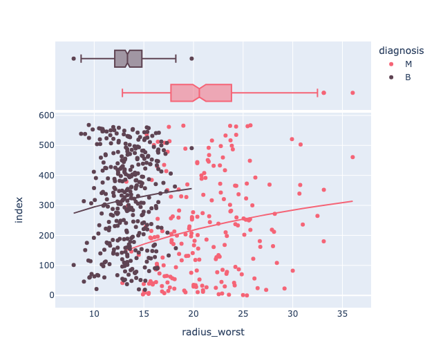

   Radius SE:
   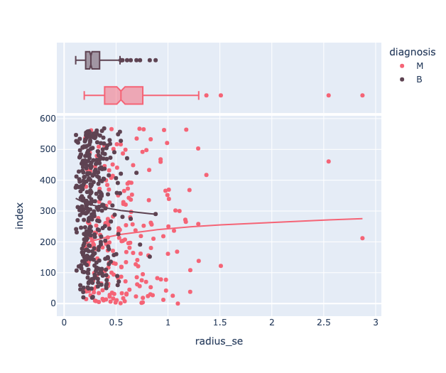

3. Perimeter

   - Lower mean perimeter suggests Benign type of tomour, with some overlap

   Mean perimeter:
   
   Worst perimeter:
   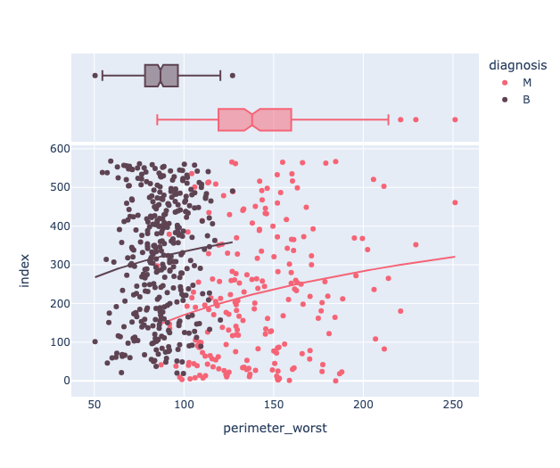
   Perimeter SE:
   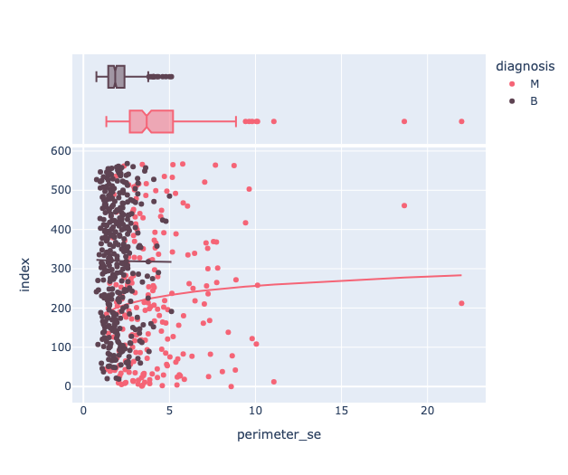

4. Smoothness

   - Diagnosis distribution correlating to mean smoothness is very similar, making the metric _possibly_ redundant

   Mean smoothness:
   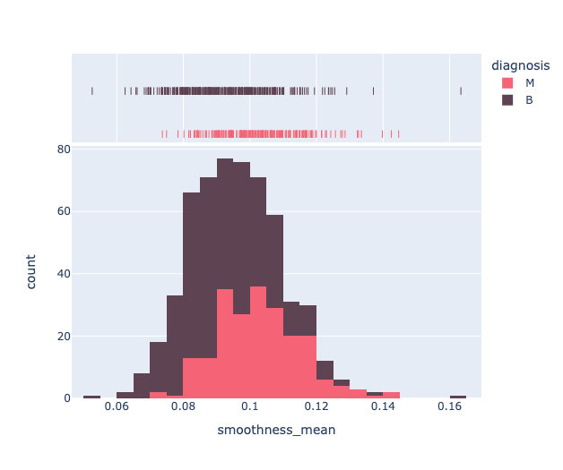
   Worst smoothness:
   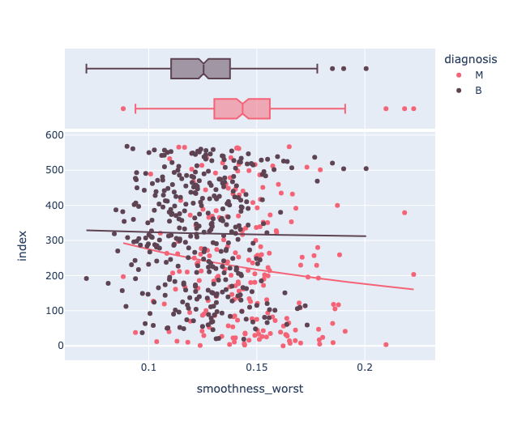
   Smoothness SE:
   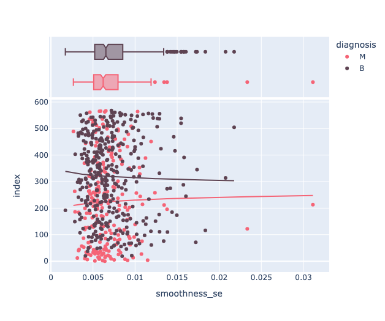

## Correlation matrix

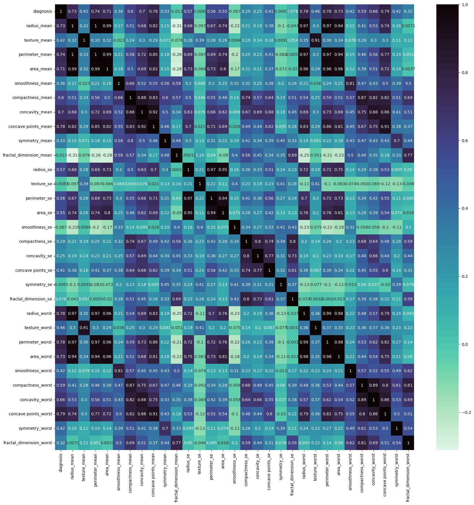

In our model we used correlation threshold to diagnosis of at least 33%.

Excluded properties:
`fractal_dimension_mean`, `texture_se`, `smoothness_se`, `compactness_se`, `concavity_se`, `symmetry_se`, `fractal_dimension_se`, `fractal_dimension_worst`
